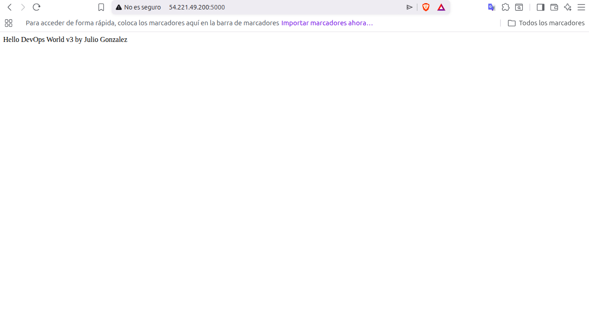
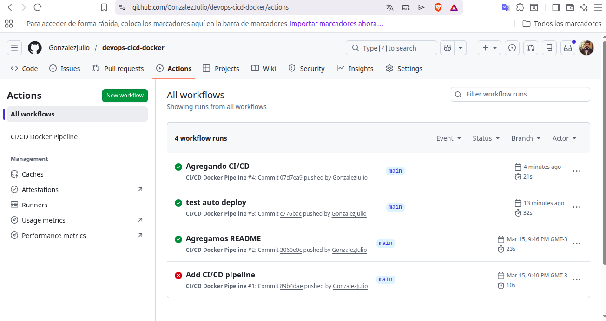
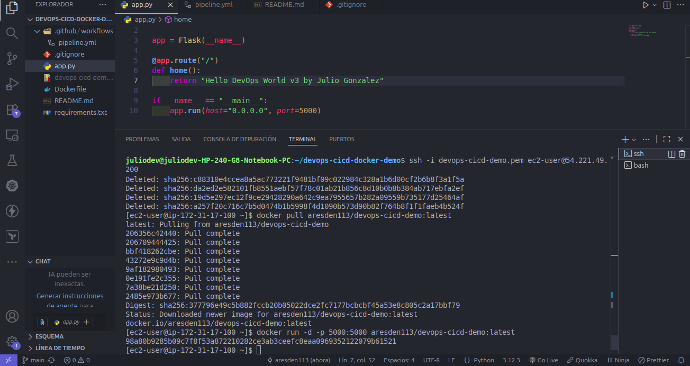

# 🚀 DevOps CI/CD Pipeline with Docker, AWS and GitHub Actions

This project demonstrates a **complete CI/CD pipeline** where a Python application is automatically built, published and deployed to a cloud server.

Every time code is pushed to the repository, a pipeline automatically builds a Docker image and deploys it to a cloud server.

---

# 🧰 Technologies Used

* Python (Flask)
* Docker
* GitHub
* GitHub Actions
* Docker Hub
* AWS EC2
* Watchtower (automatic container updates)

---

# 🏗 Architecture

```
Developer
   ↓
Git Push
   ↓
GitHub Repository
   ↓
GitHub Actions
   ↓
Build Docker Image
   ↓
Push Image → Docker Hub
   ↓
AWS EC2 Server
   ↓
Watchtower detects new image
   ↓
Container automatically updated
```

This pipeline allows **fully automated deployments**.

---

# ⚙️ How it Works

1. A developer pushes code to the GitHub repository
2. GitHub Actions triggers a CI/CD workflow
3. The workflow builds a Docker image
4. The image is pushed to Docker Hub
5. The EC2 server runs the container
6. Watchtower monitors Docker Hub for new versions
7. When a new image is detected, the container is automatically updated

This creates a **self-updating deployment pipeline**.

---

# 📸 Project Screenshots

## Application running on AWS



---

## GitHub Actions Pipeline



---

## Docker Containers running on EC2



---

# 🚀 Run Locally

Clone the repository

```
git clone https://github.com/YOUR_USERNAME/devops-cicd-docker-demo
cd devops-cicd-docker-demo
```

Build the Docker image

```
docker build -t devops-python-app .
```

Run the container

```
docker run -p 5000:5000 devops-python-app
```

Open the application

```
http://localhost:5000
```

---

# ☁️ Deployment

The application is deployed on an AWS EC2 instance using Docker.

The server automatically updates the container when a new image is published.

---

# 📌 DevOps Concepts Demonstrated

* Continuous Integration (CI)
* Continuous Deployment (CD)
* Containerization
* Cloud deployment
* Automated pipelines
* Self-updating containers
* Infrastructure in the cloud

---

# 👨‍💻 Author

Julio González
DevOps / Cloud Engineer
